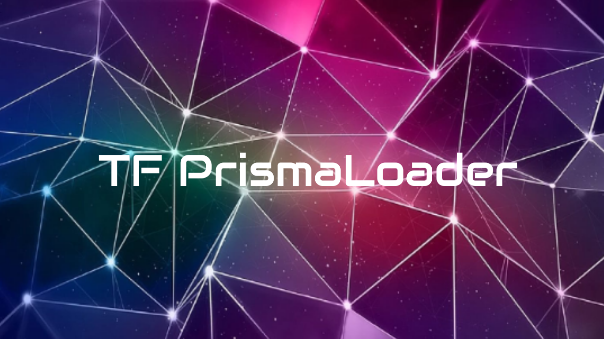
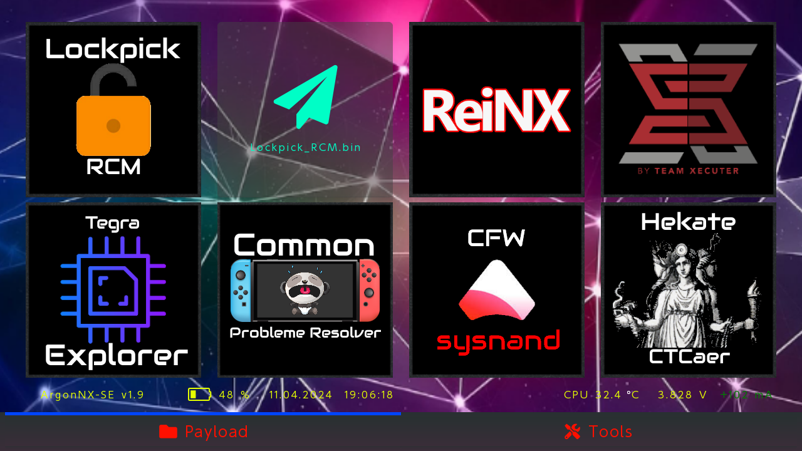
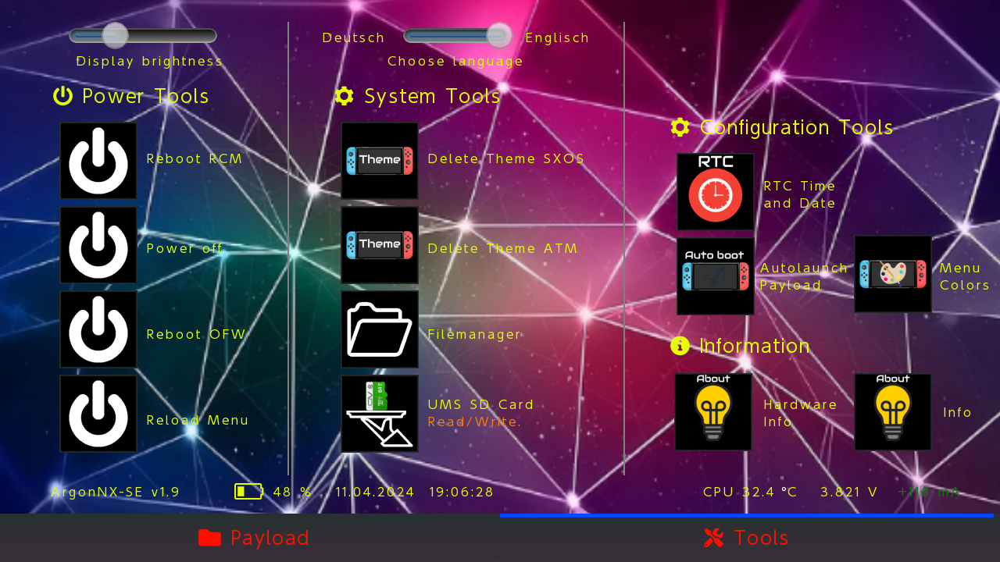

## What TF PrismaLoader is?

TF PrismaLoader is a noble gas.
"TF PrismaLoader" comes from Greek "TF PrismaLoader", neuter of "argos" meaning *lazy* , *idle* or *inactive*.
TF PrismaLoader recieved this name because of I want.

TF PrismaLoader is an immutable payload which is injected to your Nintendo Switch via Fusee Gelee exploit.

## Purpose 

The purpose of TF PrismaLoader is to stay immutable, so you can always inject it, without caring about other payloads getting updated (Always use TF PrismaLoader for TegraSmash, TegraGUI, TrinkedM0...).

## How can it be immutable?

When TF PrismaLoader is injected, it automatically launches the `payload.bin` loacted at `argon` directory on your SD Card root. 

If `payload.bin` is not present or VOLUME DOWN button is pressed on payload injection, TF PrismaLoader will list all payloads located at `argon/payloads`, and you will be able to select one of them to launch it.

## Features

- **Autolaunch/autochainload** the payload named `payload.bin` inside `argon` directory in your sd card root.
- If `argon/payload.bin` is not found or `VOLUME_DOWN_BUTTON` is held during TF PrismaLoader injection, TF PrismaLoader will list all the payloads located at `argon/payloads`, so you can select one of them to launch it.
- **Customize payloads' logos**. **Logos must be smaller or equal than 280x280** (See About BMP format section). Example:

```
argon
  ├───logos
  │     fusee-primary.bmp # Logo for fusee-primary.bin payload
  │     ReiNX.bmp # Logo for ReiNX.bin payload
  │
  └───payloads
        fusee-primary.bin
        ReiNX.bin         
        hekate.bin # Will be rendered using default logo
```

- **Custom backgrounds** can be added by placing `background.bmp` file inside `argon` directory. **The background must be smaller or equal than 1280x720**.
- Take **screenshots** to share your TF PrismaLoader gui. To capture TF PrismaLoader screen tap anywhere with two or more fingers or use the left joycon "screenshot" button.
- Touch support. Thanks to @pixel-stuck
- Simple tools. (Don't expect tools like the onew built in hekate, TF PrismaLoader tools are much more lightweighted and simple, such as reboot options)
- Command Line Interface (CLI) to facilitate the procedure to create bmp files for custom logos and backgrounds.

## About BMP format

The only format supported is **BMP 32 bit ARGB color**.
TF PrismaLoader recommends using a solid background without alpha channel (alpha channel set to 0xFF). Payloads' logos **support alpha channel**.

### Generate new logos and background

TF PrismaLoader provides a useful Command Line Interface (CLI) to create new logos and backgrounds for your payloads using a *jpg* or *png* images.

#### CLI installation

The TF PrismaLoader CLI is written in Python. To install python follow the instructions listed [here](https://realpython.com/installing-python/). Once you have python3 installed just type the following commands (These will install the requirements for running the CLI):

```bash
$ cd scripts
$ pip install -r requirements.txt
$ sudo apt-get install libmagickwand-dev
```

> If you are using Windows visit [Wand's installation page](http://docs.wand-py.org/en/0.4.1/guide/install.html) and follow the steps to install libmagikcwand on Windows.

#### CLI Usage

To generate a new logo use the following command.

```bash
$ cd scripts
$ python argon.py img-to-logo <path-to-png-jpg-img>
```

To generate a new background use the following command.

```bash
$ cd scripts
$ python argon.py generate-background <path-to-png-jpg-img>
```

The CLI stores the outputs of the commands at the recently created (also by the CLI) `sd-files/argon` directory (This directory simulates an sd-card argon structure).

To learn more about the CLI options type:

```bash
$ python argon.py --help
```

## GUI

These images were captured with the **screenshot** feature.





As you can see in the pictures, payloads are displayed in groups of 8 and each group is displayed in a different *payloads* tab.

## TF PrismaLoader sd card tree

How a full running TF PrismaLoader example looks inside the sd card:

```
argon
├─── payloads
│       ReiNX.bin
│       fusee-primary.bin
│       hekate.bin
│       SXOS.bin
|       cpr.bin
|       Tegraexplorer.bin
|       Lockpick.bin
│
├─── logos
|       fusee-primary.bmp
|       Reinx.bmp
|       hekate.bmp
|       SXOS.bmp
|       *Other files.bmp
|
├─── sys
|       minerva.bso # IMPORTANT if you want a good UX experience
|       resources.argon # IMPORTANT. Binary file containing all render resources except the background and logos
|
└─── background.bmp
└─── splash.bmp
```

## Improve performance

TF PrismaLoader can use **minerva training cell** to improve performance.
The use of minerva is optional but recommended. To use minerva just place the compiled `minerva.bso` inside `argon/sys`. The directory `argon/sys` with minerva, is included in `TF_PrismaLoader_x.x.zip` in the release section.

To learn more about Minerva Training Cell check its [official repo](https://github.com/CTCaer/minerva_tc).

## Compatibility

This payload will chainload any CFW or payload. 

Some users reported issuses when chainloading SX OS. <small>But with Atmosphere/TF OS out there... who wants SXOS?</small> 🙄

## Roadmap

1. Config file to manage tabs titles and TF PrismaLoader sd card directory tree.
2. More tools inside tools tab.

## How to launch ?
https://youtu.be/fsh3jVHWpkc?si=I5uccOfCymPFMhXT

## Credits

* __devkitPro__ for the [devkitA64](https://devkitpro.org/) toolchain.
* __naehrwert__ and __st4rk__ for the original [hekate](https://github.com/nwert/hekate) project and its hwinit code base.
* __CTCaer__ for the continued [hekate](https://github.com/CTCaer/hekate) and his **minerva** project.
* __langerhans__ and  __stuck-pixel__ for their implementation of touch support.
* __LittlevGL__ for being such a good embedded graphics library.
